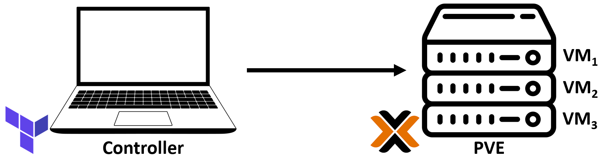

# Automate a Proxmox VM management using Cloud-init and Terraform

## Architecture

   

## How to deploy

1. [Manually create an Ubuntu cloud-init template for Proxmox](./documentation/cloud-init-manually.md)
2. [Deploy VMs in Proxmox with Terraform](./documentation/dep-proxmox-vm-terraform.md)

   > A deployment example is included on `/terraform` project folder.