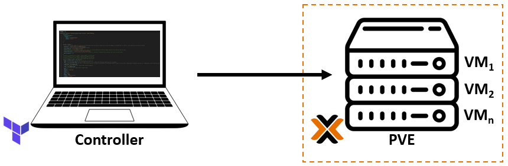

# Manually configure a Proxmox Ubuntu cloud-init image

## Where to act?

   

1. [Explore, select and download the preferred distro images from Cloud-init.](https://cloud-images.ubuntu.com/). E.g.:

    ```console
    wget https://cloud-images.ubuntu.com/focal/current/focal-server-cloudimg-amd64.img
    ```

2. Install packages:

    - Install the tools:

        ```console
        sudo apt update -y && sudo apt install libguestfs-tools -y
        ```

    - Install qemu-guest-agent

        ```console
        sudo virt-customize -a focal-server-cloudimg-amd64.img --install qemu-guest-agent
        ```

3. sdfsdf