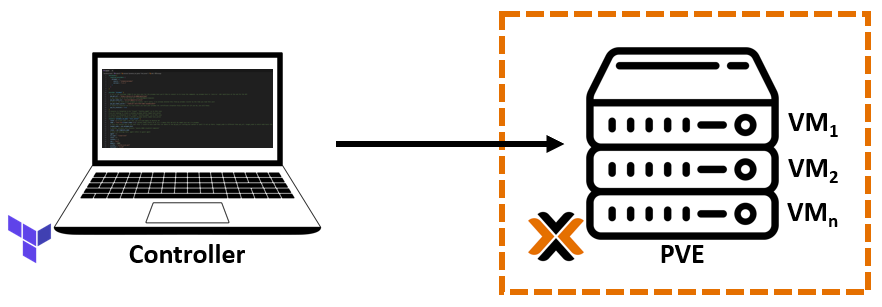
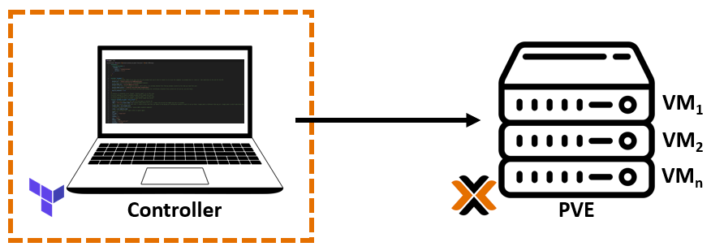

# Manually configure a Proxmox Ubuntu cloud-init image

## Where to act?

   |  |  |
   |--------------------------|--------------------------|
   | Environment 1            | Environment 2            |

1. **Environment 1**: [Explore, select and download the preferred distro images from Cloud-init.](https://cloud-images.ubuntu.com/). E.g.:

    ```console
    wget https://cloud-images.ubuntu.com/focal/current/focal-server-cloudimg-amd64.img
    ```

2. **Environment 1**: Install packages:

    - Install the tools:

        ```console
        sudo apt update -y && sudo apt install libguestfs-tools -y
        ```

    - Install qemu-guest-agent

        ```console
        sudo virt-customize -a focal-server-cloudimg-amd64.img --install qemu-guest-agent
        ```

3. **Environment 2**: Generate a key file:

    ```console
    ssh-keygen -f ./key-file -t ecdsa -b 521
    ```

4. **Environment 1**: Create a user and the necessary folders:

    ```console
    virt-customize -a focal-server-cloudimg-amd64.img --run-command 'useradd terraform'
    ```

    ```console
    virt-customize -a focal-server-cloudimg-amd64.img --run-command 'mkdir -p /home/terraform/.ssh'
    ```

5. **Environment 1**: Inject the SSH keys into the cloud image itself before turning it into a template:

    ```console
    virt-customize -a focal-server-cloudimg-amd64.img --ssh-inject terraform:file:/root/key-file.pub
    ```

    ```console
    virt-customize -a focal-server-cloudimg-amd64.img --run-command 'chown -R terraform:terraform /home/terraform'
    ```

6. **Environment 1**: Create a Proxmox virtual machine using the newly modified image

    ```console
    qm create 9000 --name "ubuntu-2004-cloudinit-template" --memory 2048 --cores 2 --net0 virtio,bridge=vmbr0
    qm importdisk 9000 focal-server-cloudimg-amd64.img local-lvm
    qm set 9000 --scsihw virtio-scsi-pci --scsi0 local-lvm:vm-9000-disk-0
    qm set 9000 --boot c --bootdisk scsi0
    qm set 9000 --ide2 local-lvm:cloudinit
    qm set 9000 --serial0 socket --vga serial0
    qm set 9000 --agent enabled=1
    ```

7. **Environment 1**: Convert VM to a template

    ```console
    qm template 9000
    ```

8. **Environment 1**: Clone the template into a full VM and set some parameters

    ```console
    qm clone 9000 999 --name test-clone-cloud-init
    ```

9. **Environment 1**: Set SSH keys and IP address

    ```console
    qm set 999 --sshkey key-file.pub
    qm set 999 --ipconfig0 ip=10.63.27.56/24,gw=10.63.27.1
    ```

10. **Environment 1**: Start up the VM

    ```console
    qm start 999
    ```
