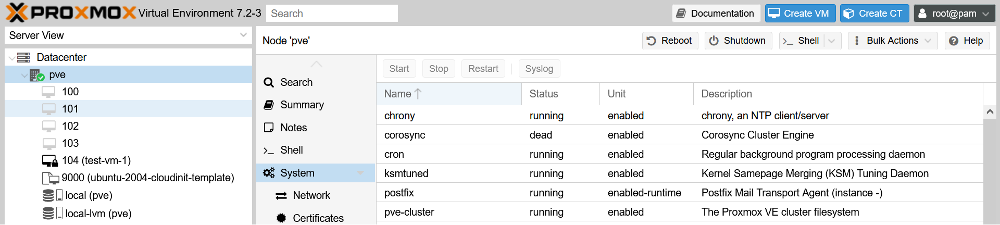
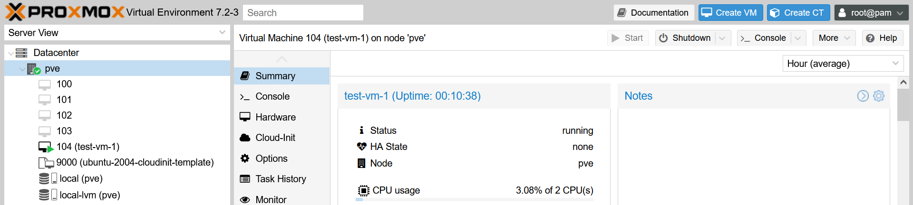
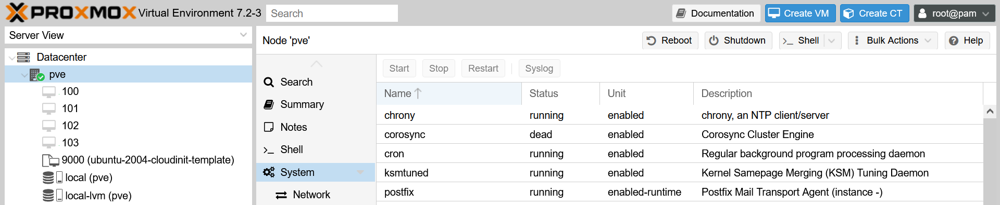

# Deploy VMs in Proxmox with Terraform

1. Install Terraform

    ```console
    curl -fsSL https://apt.releases.hashicorp.com/gpg | sudo apt-key add -
    ```

    ```console
    sudo apt-add-repository "deb [arch=$(dpkg --print-architecture)] https://apt.releases.hashicorp.com $(lsb_release -cs) main"
    ```

    ```console
    sudo apt update
    ```

    ```console
    sudo apt install terraform
    ```

2. Determine Authentication Method (use API keys)

3. Terraform basic information and provider installation

    ```console
    cd ~
    mkdir terraform-test && cd terraform-test
    touch main.tf vars.tf
    ```

4. Modify `main.tf` file:

    ```console
    terraform {
        required_providers {
            proxmox = {
                source = "telmate/proxmox"
                version = "2.9.3"
                }
            }
        }
    ```

5. Initialize Terraform

    ```console
    terraform init
    ```

    - Expected output:

        ```console
        Initializing the backend...

        Initializing provider plugins...
        - Finding telmate/proxmox versions matching "2.9.3"...
        - Installing telmate/proxmox v2.9.3...
        - Installed telmate/proxmox v2.9.3 (self-signed, key ID A9EBBE091B35AFCE)
        ...
        ...
        Terraform has been successfully initialized!
        ...
        ...
        ```

6. Validate the provider

    ```console
    terraform validate
    ```

    - Expected output:

        ```console
        Success! The configuration is valid.
        ```

7. Create a Terraform plan in `main.tf`:

    > count = 1 is used to create VMs and count = 0 is used to destroy VMs.

    ```console
    provider "proxmox" {
  
        pm_api_url = "https://10.63.27.51:8006/api2/json"
        pm_api_token_id = "xxx@pam!xxx"
        pm_api_token_secret = "xxxxxxx"
        pm_tls_insecure = true
    }

    resource "proxmox_vm_qemu" "test_server" {
        count = 1
        name = "test-vm-${count.index + 1}"
        target_node = var.proxmox_host
        clone = var.template_name
        agent = 1
        os_type = "cloud-init"
        cores = 2
        sockets = 1
        cpu = "host"
        memory = 2048
        scsihw = "virtio-scsi-pci"
        bootdisk = "scsi0"
        disk {
            slot = 0
            size = "10G"
            type = "scsi"
            storage = "local-lvm"
            iothread = 1
        }
  
        network {
            model = "virtio"
            bridge = "vmbr0"
        }

        lifecycle {
            ignore_changes = [
                network,
            ]
        }
  
        ipconfig0 = "ip=10.63.27.5${count.index + 7}/24,gw=10.63.27.1"
  
        sshkeys = <<EOF
        ${var.ssh_key}
        EOF
    }
    ```

8. Create a `vars.tf` file including the following fields:

    > *variable "ssh_key" refers to public key generated in the terraform controller.*

    ```console
    variable "ssh_key" {
        default = "xxx"
    }

    variable "proxmox_host" {
        default = "xxx"
    }

    variable "template_name" {
        default = "xxx"
    }
    ```

9. Run the plan

    ```console
    terraform plan
    ```

    - Expected output:

        ```console
        Terraform used the selected providers to generate the following execution plan. Resource actions are indicated with the following symbols:
          + create

        Terraform will perform the following actions:

          # proxmox_vm_qemu.test_server[0] will be created
          + resource "proxmox_vm_qemu" "test_server" {
              + additional_wait           = 0
        ...
        ...
        ```

10. Execute the Terraform plan:

    > count = 1

    ```console
    terraform apply --auto-approve
    ```

    - Expected output:

        ```console
        Terraform used the selected providers to generate the following execution plan. Resource actions are indicated with the
        following symbols:
          + create

        Terraform will perform the following actions:

          # proxmox_vm_qemu.test_server[0] will be created
          + resource "proxmox_vm_qemu" "test_server" {
        
        ...
        Plan: 1 to add, 0 to change, 0 to destroy.
        proxmox_vm_qemu.test_server[0]: Creating...
        proxmox_vm_qemu.test_server[0]: Still creating... [10s elapsed]
        proxmox_vm_qemu.test_server[0]: Still creating... [20s elapsed]
        proxmox_vm_qemu.test_server[0]: Still creating... [30s elapsed]
        proxmox_vm_qemu.test_server[0]: Still creating... [40s elapsed]
        proxmox_vm_qemu.test_server[0]: Still creating... [50s elapsed]
        proxmox_vm_qemu.test_server[0]: Creation complete after 57s [id=pve/qemu/104]

        Apply complete! Resources: 1 added, 0 changed, 0 destroyed.
        ```

        |  |  |
        |--------------------------|--------------------------|
        | VM creation            | VM created            |

    > count = 0

    ```console
    terraform apply --auto-approve
    ```

    - Expected output:

        ```console
        proxmox_vm_qemu.test_server[0]: Refreshing state... [id=pve/qemu/104]

        Terraform used the selected providers to generate the following execution plan. Resource actions are indicated with the
        following symbols:
          - destroy

        Terraform will perform the following actions:

        # proxmox_vm_qemu.test_server[0] will be destroyed
        # (because index [0] is out of range for count)
        - resource "proxmox_vm_qemu" "test_server" {
              - additional_wait           = 0 -> null
              - agent                     = 1 -> null

        ...
        Plan: 0 to add, 0 to change, 1 to destroy.
        proxmox_vm_qemu.test_server[0]: Destroying... [id=pve/qemu/104]
        proxmox_vm_qemu.test_server[0]: Destruction complete after 4s

        Apply complete! Resources: 0 added, 0 changed, 1 destroyed.
        ```

        |  |
        |------------------------------------|
        | VM destroyed                       |
